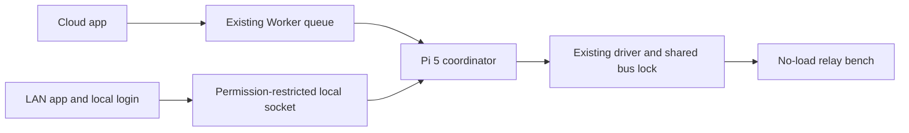

# Farm LAN fallback

Task OWNER-LAN-001, owner SUCHA, branch `pick/lan-fallback-v1`, source `858d4ce`.
Pick explicitly requested the offline site, independent login, one Pi controller and LAN/Cloud plus cached-forecast indication. This is a scoped exception to the earlier collaboration-only LAN boundary. Public hosting remains the existing owner Worker. Commerce, field irrigation, router configuration and Windows firewall are outside this change.

## Use

Open `/lan-setup.html` on the main app for the one-time device certificate setup. On the farm Wi-Fi, open `https://farmultimate.local:8443/` and log in with the provisioned sensor-owner email/password. Internet access and the Cloud login server are unnecessary for this request. The router, Pi 5 and local network must stay powered and reachable; Wi-Fi client isolation must not block the Pi. The LAN origin has its own cookie and browser storage. It includes the map, telemetry/history, Pi health, energy surface, cached forecast and no-load relay bench. Commerce stays on the Cloud app.

The server certificate is issued by a farm CA constrained to `farmultimate.local`. Only the public certificate/profile is shipped with the website. Private keys stay root-protected on Pi 5. On iPhone/iPad, install the profile and manually enable its trust following [Apple's instructions](https://support.apple.com/en-us/102390). A successful automated TLS test does not install trust on an owner's phone. Do not bypass certificate warnings. The leaf expires after one year; renew with the reviewed provision script before expiry, validate and restart only the LAN service. The farm CA expires after five years.

The listener binds the Pi's inspected LAN address and accepts only that connected subnet. Avahi publishes one marked logical alias; the machine hostname is unchanged. This installation assumes the Pi retains that address. If DHCP changes it, re-check the new network and deliberately update protected configuration/mDNS; do not broaden the listener. No router, WAN, public tunnel or Windows firewall settings are changed.

## Authentication and observations

The same owner's PBKDF2 verifier is copied once through an authenticated admin channel into `/etc/sucha-farm-lan/owner.json` (root:LAN service, 0640). No plaintext password, API token, Cloud session or device token is copied. Never print the verifier. Cloud password/account revocation is not automatically synchronized while offline; refresh/remove the LAN verifier through the admin setup when changing the owner account. Changing it invalidates existing local sessions.

Sessions use a random HttpOnly Secure SameSite=Strict cookie, expire after eight hours and are hashed in local SQLite. Login is rate limited. Exact Host, same-origin POST, peer-subnet and JSON/body-size guards reject cross-site/rebinding traffic. Only assets in the generated manifest are served. The API accepts sensor reads and authenticated relay IPC, not Cloud business writes or registration. SQLite telemetry is opened read-only with query-only mode. Energy is shown as awaiting ingest until verified measurements exist.

## One controller

The existing sole-writer file lock and shared Modbus bus lock remain. LAN web workers never import or call the hardware driver. LAN and Cloud dispatch converge under one controller lock; network waits happen outside it. Each ON is still a five-second pulse with hardware timer, identity/mode/CRC/readback checks, and a 15-minute no-load authorization. Field outputs remain uncommissioned. No latched ON, pumps or valves are introduced.

Taking LAN ownership requires a ready all-off controller and no active Cloud lease. Cloud requests cannot start while LAN owns it. A new control epoch rejects delayed local requests and delayed Cloud responses; journal IDs reject duplicates and OFF creates cancellation tombstones. Cloud transport loss stops Cloud pulses and rotates the device instance, retiring the old Cloud queue on reconnect. LAN pulses survive Cloud-only transport loss; hardware faults still force all-off. LAN expiry/logout/restart closes the lease and verifies all-off. Reconnect never rearms automatically.

The weather timer saves only a validated newer public forecast every 15 minutes, preserving its original issued/valid times. A failed fetch keeps the previous file. The LAN screen labels the stored snapshot and refuses to present expired predictions as current.

## Installation and rollback

1. Run JS/Worker checks, Python controller/auth tests, browser checks with external traffic blocked, and a scoped secret scan. Build the allowlisted owner package followed by `node scripts/build-lan-site.mjs` from a committed release.
2. Prepare the dedicated Linux user, isolated pinned Flask/Gunicorn venv, protected certificate/network configuration and owner verifier. Do not overwrite existing config on drift. Provisioning prints public certificates only.
3. Deploy the reviewed frontend Worker arbitration before switching the Pi agent. Verify the existing backend version and Cloud release; no migration is needed.
4. Transfer the reviewed tar to a dedicated `/tmp/sucha-lan-*` directory. Run `scripts/lan/install.py --source <candidate-directory> --expected-agent-sha <verified-old-sha>`. It checks the old agent, unused port, no existing service/name and actual all-off readback. It keeps the old agent under `/var/lib/sucha-farm-lan-install`, installs versioned assets, a scoped service drop-in and the weather timer, and publishes the marked mDNS alias. Log only safe result codes/version hashes.
5. Independently verify TLS chain/host, asset release, anonymous auth guards, service state, owner configuration permissions and actual readbacks. Run scoped Cloud-outage simulation and finish disarmed/all-off.

Rollback: run `/opt/sucha-farm-lan/app/uninstall.py` as root. This disables only the LAN web/cache services, restores the verified original agent and removes this task's drop-in/mDNS line. It retains certificates, account config, local sessions, telemetry and release files for review. If also rolling the Cloud frontend back, stop LAN ownership first and use the exact recorded pre-release Worker version. Do not roll back the backend or database. Uninstaller syntax/source is checked; a full live rollback is separate from normal release verification.

## Verification boundaries

- Python tests exercise real Flask cookie/auth boundaries with fixture credentials and fake controller faults/timers; no owner's plaintext password is available to automation.
- Browser fixture screenshots explicitly distinguish mocked API data from live Pi evidence. Cold browser tests block all external requests.
- `/run/sucha-relay-bench/wan-test.block` simulates the coordinator's Cloud transport failure only. It does not disconnect the router, Pi telemetry publisher, weather process or SSH. Test cache retention separately, and remove this root/operator-only flag afterward.
- Real owner phone certificate trust, owner password login, router power loss, physical WAN removal and DHCP reassignment require the corresponding on-site scenario. Do not label these verified from a simulation.

Runtime reference: [Gunicorn settings](https://gunicorn.org/reference/settings/). Existing Cloud API, public origin and data are preserved.
